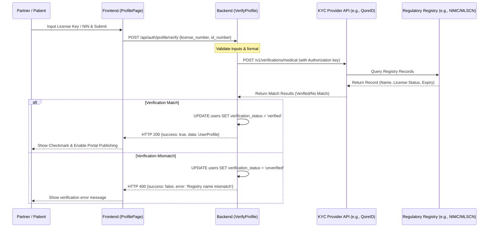

# Further Implementations: Medical License & Identity Verification

This document outlines the architecture and workflows for implementing production-ready medical license and identity verification systems for the MedBook Diagnostics platform.

---

## Option A: Automated Third-Party KYC & Registry APIs

This option focuses on real-time, programmatic verification by connecting directly to national databases (NIMC) and professional registries (MLSCN/MDCN) via authorized third-party verification middleware.

### 1. Verification Partners (Nigeria Context)
* **QoreID (formerly VerifyMe)**: Direct verification integrations for National Identification Numbers (NIN) and professional medical credentials.
* **Prembly (Identitypass)**: APIs for business validation (CAC), NIN validation, and medical practitioner licensing registries.
* **Smile ID**: Industry-standard identity validation, document verification, and biometrics.

### 2. Architecture & API Sequence


### 3. API Integration Sample Payload
When sending verification requests to providers like **QoreID** (VerifyMe), the backend makes an HTTP request to their lookup endpoints:

**Request Header**:
```http
Authorization: Bearer <KYC_API_SECRET_KEY>
Content-Type: application/json
```

**NIN Verification Request**:
```json
{
  "nin": "10293847561",
  "firstname": "John",
  "lastname": "Doe"
}
```

**Medical License Verification Request (MLSCN/MDCN)**:
```json
{
  "license_number": "MLSCN-87654",
  "board": "MLSCN",
  "fullname": "John Doe"
}
```

---

## Option B: Manual Admin Review Queue Workflow

For databases that do not provide reliable, real-time query APIs, or as a cost-effective backup, a manual verification queue is standard. This flow relies on document uploads and platform administrator validation.

### 1. Life Cycle States
* `unverified` (default): User is registered but has not submitted verification documents.
* `pending`: Verification files have been uploaded; awaiting platform admin action.
* `verified`: Admin reviewed and approved the documents; laboratory can list tests.
* `rejected`: Verification was denied (e.g. blurred image, expired license).

### 2. Step-by-Step Flow
1. **Document Upload**: The lab partner uploads a high-resolution scan of their medical certificate or annual practice license PDF (max 5MB) on the profile page.
2. **State Transition**: The profile updates their status to `pending` and logs the document URL (`verification_document`) in the database.
3. **Admin Alert**: A notification is sent to the admin dashboard (or a Slack channel webhook) indicating a new partner is awaiting approval.
4. **Manual Lookup**: The platform administrator logs into the secure admin panel, reviews the certificate scan, and verifies the practitioner's status on the public board portal (e.g. `mlscn.gov.ng`).
5. **Approval/Rejection**: 
   * **Approve**: Sets `verification_status = 'verified'`. Activates their listing.
   * **Reject**: Sets `verification_status = 'rejected'`. Sends an email requesting a re-upload with a description of the error.

### 3. Database Schema Modifications
To support Option B, the schema tracks verification history:
```sql
ALTER TABLE users ADD COLUMN verification_notes TEXT NULL;
ALTER TABLE users ADD COLUMN verified_at TIMESTAMP NULL;
ALTER TABLE users ADD COLUMN verified_by VARCHAR(255) NULL;
```
